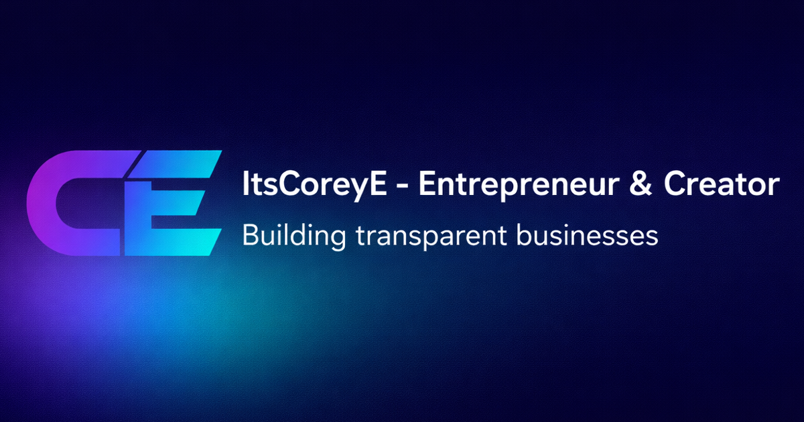

# ItsCoreyE - Portfolio Website



Professional portfolio website for ItsCoreyE - Entrepreneur & Creator. Showcasing three active ventures: Roblox UGC Creation, Odds Up (Prize Competitions), and Fix My Rig (IT Support).

🌐 **Live Site:** [www.itscoreye.com](https://www.itscoreye.com)

## 🚀 About

This portfolio website showcases ItsCoreyE's entrepreneurial journey and active ventures with a focus on transparency and real-time metrics. Built with modern web technologies for optimal performance and user experience.

### Featured Ventures

- **ItsCoreyE UGC** - Roblox UGC Creator building quality digital items
- **Odds Up** - Fair prize competition platform with realistic odds
- **Fix My Rig** - Remote IT support service providing expert tech assistance

## 🛠️ Tech Stack

- **Framework:** [Next.js 15](https://nextjs.org/) (App Router)
- **Language:** TypeScript
- **Styling:** Tailwind CSS
- **Animations:** Framer Motion
- **Icons:** Heroicons
- **Build Tool:** Turbopack

## ✨ Features

- 🎨 Modern, responsive design with purple-cyan gradient theme
- 📱 Fully optimized for mobile devices
- 📊 Real-time Roblox UGC statistics integration
- 🎯 Live milestone tracking with Discord webhooks
- 🔐 Protected admin panel for content management
- ⚡ Performance-optimized with lazy loading
- 🌐 SEO-ready with proper metadata and sitemap
- 🎭 Smooth animations and transitions
- 📈 Schema.org structured data for rich search results

## 🏃‍♂️ Getting Started

### Prerequisites

- Node.js 18.0 or higher
- npm, yarn, pnpm, or bun

### Installation

1. Clone the repository:
```bash
git clone https://github.com/ItsCoreyE/itscoreye-website.git
cd itscoreye-website
```

2. Install dependencies:
```bash
npm install
# or
yarn install
# or
pnpm install
```

3. Create a `.env.local` file with required environment variables:
```env
ADMIN_PASSWORD=your_admin_password
DISCORD_WEBHOOK_URL=your_discord_webhook_url
DISCORD_PING_ROLE_ID=your_milestone_ping_role_id
# Optional: dedicated monthly stats webhook and ping role
DISCORD_CSV_WEBHOOK_URL=your_csv_discord_webhook_url
DISCORD_CSV_PING_ROLE_ID=your_discord_role_id
```

4. Run the development server:
```bash
npm run dev
# or
yarn dev
# or
pnpm dev
```

5. Open [http://localhost:3000](http://localhost:3000) in your browser

## 📁 Project Structure

```
itscoreye-website/
├── public/              # Static assets
│   ├── icons/          # Favicon and app icons
│   ├── og-image.png    # Social media preview image
│   └── sitemap.xml     # SEO sitemap
├── src/
│   ├── app/            # Next.js App Router pages
│   │   ├── api/        # API routes
│   │   ├── admin/      # Admin panel page
│   │   ├── layout.tsx  # Root layout with metadata
│   │   └── page.tsx    # Homepage
│   ├── components/     # React components
│   │   ├── admin/      # Admin-specific components
│   │   └── ...         # Main site components
│   └── hooks/          # Custom React hooks
└── ...
```

## 🎯 Key Components

- **Hero** - Landing section with gradient branding
- **VenturesOverview** - Three venture cards with live status
- **LiveStats** - Real-time Roblox UGC metrics
- **FeaturedItems** - Showcase of best-selling UGC items
- **MilestonesSection** - Achievement timeline
- **AboutSection** - Professional background and skills
- **Contact** - Multi-channel contact options

## 🔧 Configuration

### Environment Variables

- `ADMIN_PASSWORD` - Password for admin panel access
- `DISCORD_WEBHOOK_URL` - Discord webhook for milestone notifications (also used for CSV stats if dedicated CSV webhook is not set)
- `DISCORD_PING_ROLE_ID` - (Optional) role ID to ping for milestone notifications
- `DISCORD_CSV_WEBHOOK_URL` - (Optional) dedicated Discord webhook for monthly CSV/growth notifications
- `DISCORD_CSV_PING_ROLE_ID` - (Optional) role ID to ping for monthly CSV/growth notifications

### Metadata Configuration

SEO and social media metadata can be updated in `src/app/layout.tsx`:
- Page titles and descriptions
- OpenGraph and Twitter Card settings
- Structured data (Schema.org)

## 📱 Mobile Optimization

- Hero section: 70vh on mobile, 75vh on larger screens
- Section padding: 2.5rem mobile → 4rem tablet → 5rem desktop
- Responsive typography scaling
- Touch-friendly button sizes (44px minimum)
- Progressive grid breakpoints (1 col → 2 col → 3 col)

## 🚢 Deployment

### Vercel (Recommended)

1. Push your code to GitHub
2. Import project on [Vercel](https://vercel.com)
3. Add environment variables
4. Deploy!

### Other Platforms

The site can be deployed on any platform supporting Next.js:
- Netlify
- Railway
- AWS Amplify
- Self-hosted with Node.js

## 🤝 Contributing

This is a personal portfolio website. For bug reports or suggestions, please open an issue on GitHub.

## 📄 License

© 2025 ItsCoreyE. All rights reserved.

## 🔗 Links

- **Website:** [www.itscoreye.com](https://www.itscoreye.com)
- **Roblox:** [@ItsCoreyE](https://www.roblox.com/users/3504185/profile)
- **TikTok:** [@itscoreye](https://www.tiktok.com/@itscoreye)
- **Discord:** [Join Server](https://discord.gg/nbQArRaq8m)

---

Built with ❤️ by ItsCoreyE
